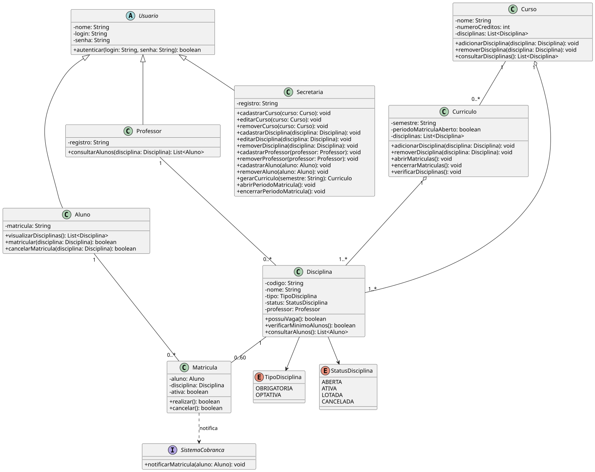

# 🎓 Sistema de Matrículas

Repositório dedicado ao desenvolvimento do **Sistema de Matrículas**, projeto prático desenvolvido para a disciplina de **Projeto de Software** da **PUC Minas**.

O objetivo do sistema é informatizar a gestão acadêmica de uma universidade, contemplando a oferta de disciplinas pela secretaria, o processo de matrícula dos alunos, o acompanhamento pelos professores e a notificação ao sistema de cobranças.

---

## 📚 Informações Acadêmicas

* **Instituição:** Pontifícia Universidade Católica de Minas Gerais (PUC Minas)
* **Curso:** Engenharia de Software
* **Disciplina:** Projeto de Software
* **Professora:** Milena Menezes Adão
* **Semestre:** 2º Semestre / 2026

---

## 👥 Equipe de Desenvolvimento

* Arthur Martins Candido
* Felipe Costa Lisboa
* Gustavo Leonardi Ribeiro de Almeida
* Sofia Fernandes Ferreira Silva

---

## 🚀 Status do Projeto: Sprint 02 (Lab01S02)

Fase atual de **modelagem estrutural e criação da estrutura inicial do projeto Java**.

### Entregas

#### Sprint 01 — Lab01S01

* [x] Diagrama de Casos de Uso (UML)
* [x] Histórias de Usuário (User Stories)

#### Sprint 02 — Lab01S02

* [x] Revisão dos diagramas desenvolvidos
* [x] Diagrama de Classes (UML)
* [ ] Criação do projeto Java
* [ ] Criação das classes e atributos modelados
* [ ] Criação dos stubs dos métodos modelados

---

## 1. Descrição do Sistema

O sistema tem como objetivo informatizar o processo de matrículas de uma universidade.

A secretaria é responsável por gerar o currículo de cada semestre e manter as informações referentes aos cursos, disciplinas, professores e alunos.

Durante o período de matrículas, os alunos podem se matricular em até **4 disciplinas obrigatórias** e **2 disciplinas optativas**, além de cancelar matrículas realizadas anteriormente.

Uma disciplina somente ocorrerá no semestre seguinte caso possua, ao final do período de matrículas, pelo menos **3 alunos matriculados**. Caso contrário, a disciplina será cancelada.

Cada disciplina possui um limite máximo de **60 alunos**. Ao atingir esse limite, novas matrículas na disciplina são encerradas.

Após a inscrição do aluno para o semestre, o **Sistema de Cobranças** é notificado para que seja realizada a cobrança referente às disciplinas selecionadas.

Os professores podem consultar os alunos matriculados nas disciplinas que lecionam.

Todos os usuários do sistema possuem login e senha para autenticação.

---

## 2. Diagrama de Casos de Uso


### Atores

* **Aluno**
* **Professor**
* **Secretaria**
* **Sistema de Cobranças** — sistema externo

### Relacionamentos

* `«include»`: Matricular, Cancelar Matrícula e Consultar Alunos exigem autenticação.
* `«include»`: ao realizar uma matrícula, o Sistema de Cobranças é notificado.
* `«extend»`: ao atingir 60 alunos, as inscrições da disciplina são encerradas.
* `«extend»`: ao encerrar o período de matrículas, disciplinas com menos de 3 alunos são canceladas.

### Operações de manutenção

Os casos de uso **Manter Curso**, **Manter Disciplina**, **Manter Professor** e **Manter Aluno** representam as operações de:

* Cadastrar
* Consultar
* Editar
* Remover

---

## 3. Histórias de Usuário

### 👨‍🎓 Aluno

* **US01** — Como aluno, quero fazer login com usuário e senha, para acessar as funcionalidades de matrícula.
* **US02** — Como aluno, quero visualizar as disciplinas obrigatórias e optativas do período de matrícula, para escolher em quais me matricular.
* **US03** — Como aluno, quero me matricular em até 4 disciplinas obrigatórias e 2 optativas, para compor minha grade do semestre.
* **US04** — Como aluno, quero cancelar uma matrícula feita anteriormente, durante o período de matrículas, para ajustar minha grade.
* **US05** — Como aluno, quero ser impedido de me matricular em uma disciplina que já atingiu 60 alunos, para respeitar o limite de vagas.
* **US06** — Como aluno matriculado, quero que o sistema de cobranças seja notificado automaticamente, para ser cobrado corretamente pelas disciplinas do semestre.

### 👨‍🏫 Professor

* **US07** — Como professor, quero fazer login no sistema, para acessar as informações das minhas disciplinas.
* **US08** — Como professor, quero consultar a lista de alunos matriculados em cada disciplina que leciono, para me preparar para o semestre.

### 🏫 Secretaria

* **US09** — Como secretária, quero fazer login no sistema, para gerenciar cursos, disciplinas, professores e alunos.
* **US10** — Como secretária, quero manter cursos (cadastrar, consultar, editar e remover), com nome e número de créditos, para organizar a oferta acadêmica.
* **US11** — Como secretária, quero manter disciplinas (cadastrar, consultar, editar e remover) associadas a um curso, para compor o currículo de cada semestre.
* **US12** — Como secretária, quero manter professores e alunos (cadastrar, consultar, editar e remover), para que possam fazer login no sistema.
* **US13** — Como secretária, quero gerar o currículo de cada semestre, para disponibilizar as disciplinas que os alunos podem cursar.
* **US14** — Como secretária, quero abrir e encerrar o período de matrículas, para controlar quando os alunos podem se matricular ou cancelar.

### ⚙️ Regras de Negócio Automáticas

* **US15** — Como sistema, quero cancelar automaticamente disciplinas com menos de 3 alunos matriculados ao final do período de matrículas, para não manter turmas inviáveis.
* **US16** — Como sistema, quero encerrar automaticamente as inscrições de uma disciplina ao atingir 60 alunos matriculados, para respeitar o limite máximo de vagas.

---

## 4. Diagrama de Classes

O Diagrama de Classes representa a estrutura do Sistema de Matrículas e serve como base para a implementação das classes Java.



### Principais classes

* `Usuario`
* `Aluno`
* `Professor`
* `Secretaria`
* `Curso`
* `Curriculo`
* `Disciplina`
* `Matricula`

### Tipos auxiliares

* `TipoDisciplina`
* `StatusDisciplina`

### Sistema externo

* `SistemaCobranca`

A classe abstrata `Usuario` concentra as informações comuns de autenticação e identificação dos usuários do sistema. `Aluno`, `Professor` e `Secretaria` especializam essa classe.

A classe `Matricula` representa a associação entre um aluno e uma disciplina.

As disciplinas podem ser classificadas como **obrigatórias** ou **optativas** e possuem controle de status para representar sua situação durante o processo de matrícula.

---

## 5. Regras de Negócio

O sistema deverá respeitar as seguintes regras:

1. Um aluno pode se matricular em no máximo **4 disciplinas obrigatórias**.
2. Um aluno pode se matricular em no máximo **2 disciplinas optativas**.
3. Uma disciplina pode possuir no máximo **60 alunos matriculados**.
4. Ao atingir 60 alunos, novas matrículas na disciplina devem ser bloqueadas.
5. Ao final do período de matrículas, uma disciplina precisa possuir pelo menos **3 alunos matriculados**.
6. Disciplinas com menos de 3 alunos ao final do período devem ser canceladas.
7. Matrículas e cancelamentos somente podem ser realizados enquanto o período de matrículas estiver aberto.
8. O Sistema de Cobranças deve ser notificado após a matrícula do aluno.
9. Professores somente consultam os alunos das disciplinas que lecionam.
10. O acesso às funcionalidades do sistema requer autenticação por login e senha.

---

## 6. Implementação

O sistema será desenvolvido utilizando **Java**, seguindo os modelos UML definidos durante as etapas de análise e projeto.

A aplicação será executada por **linha de comando (CLI)**.

A persistência dos dados será realizada utilizando **arquivos**, sem utilização de banco de dados.

### Tecnologias

* Java
* Programação Orientada a Objetos
* UML
* PlantUML
* Persistência em arquivos
* Interface por linha de comando

---

## 7. Estrutura Inicial do Projeto

```text id="fylyh4"
sistema-de-matricula/
│
├── diagrams/
│   ├── use_case_diagram.svg
│   └── class_diagram.svg
│
├── src/
│   ├── Main.java
│   │
│   ├── model/
│   │   ├── Usuario.java
│   │   ├── Aluno.java
│   │   ├── Professor.java
│   │   ├── Secretaria.java
│   │   ├── Curso.java
│   │   ├── Curriculo.java
│   │   ├── Disciplina.java
│   │   ├── Matricula.java
│   │   ├── TipoDisciplina.java
│   │   └── StatusDisciplina.java
│   │
│   └── external/
│       └── SistemaCobranca.java
│
├── data/
│   └── arquivos de persistência
│
└── README.md
```

> A implementação da persistência em arquivos e das principais funcionalidades do sistema será realizada na Sprint 03.

---

## 8. Próximas Etapas

### Sprint 02

* Finalizar a estrutura do projeto Java.
* Criar as classes definidas no Diagrama de Classes.
* Criar os atributos modelados.
* Criar os stubs dos métodos.
* Garantir o alinhamento entre o código Java e o Diagrama de Classes.

### Sprint 03

* Implementar as regras de negócio.
* Implementar matrícula e cancelamento.
* Implementar autenticação.
* Implementar interface por linha de comando.
* Implementar persistência em arquivos.
* Implementar consulta de alunos por disciplina.
* Implementar as regras de mínimo e máximo de alunos.
* Integrar a notificação ao Sistema de Cobranças.
* Revisar os modelos UML conforme as alterações realizadas durante a implementação.
