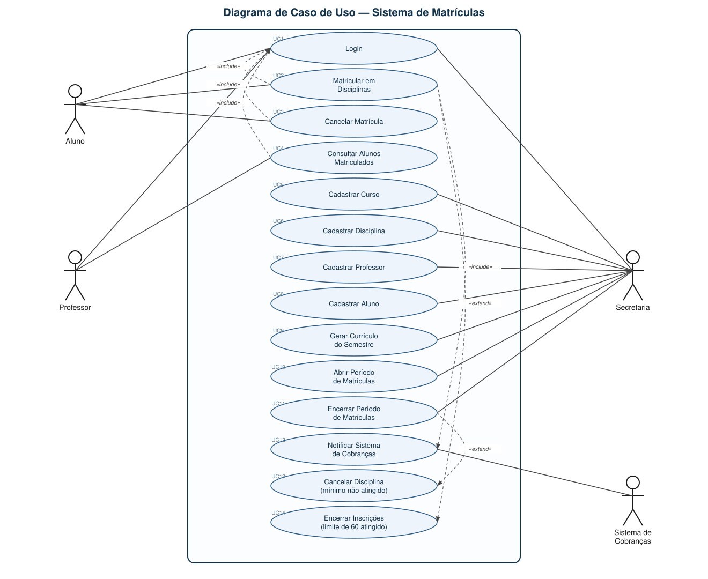

# 🎓 Sistema de Matrículas

Repositório dedicado ao desenvolvimento do **Sistema de Matrículas**, projeto prático estruturado para a disciplina de **Projeto de Software** da **PUC Minas**.

O objetivo deste sistema é informatizar a gestão acadêmica de uma universidade, contemplando a oferta de disciplinas pela secretaria, o processo de matrícula dos alunos, o acompanhamento pelos professores e a notificação para o sistema de cobranças.

---

### 📚 Informações Acadêmicas
* **Instituição:** Pontifícia Universidade Católica de Minas Gerais (PUC Minas)
* **Curso:** Engenharia de Software
* **Disciplina:** Projeto de Software
* **Professora:** Milena Menezes Adão
* **Semestre:** 2º Semestre / 2026

### 👥 Equipe de Desenvolvimento
* Arthur Martins
* Felipe Costa
* Gustavo Leonardi Ribeiro de Almeida
* Sofia Fernandes

### 🚀 Status do Projeto: Sprint 01 (Lab01S01)
Fase atual de levantamento de requisitos e modelagem de análise. 
**Entregas desta etapa:**
- [x] Diagrama de Casos de Uso (UML).
- [x] Histórias de Usuário (User Stories).

## 1. Descrição do Sistema

Sistema para informatizar a matrícula de alunos em uma universidade. A secretaria gera o
currículo de cada semestre e mantém informações de cursos, disciplinas, professores e alunos.
Alunos se matriculam em até 4 disciplinas obrigatórias e 2 optativas durante o período de
matrículas, podendo também cancelar matrículas feitas anteriormente. Uma disciplina só ocorre
no semestre seguinte se tiver, ao final do período, pelo menos 3 alunos matriculados; caso
contrário é cancelada. O limite máximo por disciplina é de 60 alunos, encerrando-se as
inscrições ao atingir esse número. Ao final da matrícula, o sistema de cobranças é notificado
para cobrança das disciplinas do semestre. Professores consultam os alunos matriculados em suas
disciplinas. Todo usuário possui login e senha.

## 2. Diagrama de Caso de Uso

**Atores:** Aluno, Professor, Secretaria, Sistema de Cobranças (sistema externo).

- `«include»`: Matricular, Cancelar Matrícula e Consultar Alunos sempre exigem Login; Matricular sempre notifica o Sistema de Cobranças.
- `«extend»`: ao matricular, se a disciplina atingir 60 alunos, as inscrições são encerradas; ao encerrar o período de matrículas, disciplinas sem o mínimo de 3 alunos são canceladas.

## 3. Histórias de Usuário

### Aluno

- **US01** — Como aluno, quero fazer login com usuário e senha, para acessar as funcionalidades de matrícula.
- **US02** — Como aluno, quero visualizar as disciplinas obrigatórias e optativas do período de matrícula, para escolher em quais me matricular.
- **US03** — Como aluno, quero me matricular em até 4 disciplinas obrigatórias e 2 optativas, para compor minha grade do semestre.
- **US04** — Como aluno, quero cancelar uma matrícula feita anteriormente, durante o período de matrículas, para ajustar minha grade.
- **US05** — Como aluno, quero ser impedido de me matricular em uma disciplina que já atingiu 60 alunos, para respeitar o limite de vagas.
- **US06** — Como aluno matriculado, quero que o sistema de cobranças seja notificado automaticamente, para ser cobrado corretamente pelas disciplinas do semestre.

### Professor

- **US07** — Como professor, quero fazer login no sistema, para acessar as informações das minhas disciplinas.
- **US08** — Como professor, quero consultar a lista de alunos matriculados em cada disciplina que leciono, para me preparar para o semestre.

### Secretaria

- **US09** — Como secretária, quero fazer login no sistema, para gerenciar cursos, disciplinas, professores e alunos.
- **US10** — Como secretária, quero cadastrar cursos com nome e número de créditos, para organizar a oferta acadêmica.
- **US11** — Como secretária, quero cadastrar disciplinas associadas a um curso, para compor o currículo de cada semestre.
- **US12** — Como secretária, quero cadastrar professores e alunos, para que possam fazer login no sistema.
- **US13** — Como secretária, quero gerar o currículo de cada semestre, para disponibilizar as disciplinas que os alunos podem cursar.
- **US14** — Como secretária, quero abrir e encerrar o período de matrículas, para controlar quando os alunos podem se matricular ou cancelar.

### Regras de Negócio Automáticas (Sistema)

- **US15** — Como sistema, quero cancelar automaticamente disciplinas com menos de 3 alunos matriculados ao final do período de matrículas, para não manter turmas inviáveis.
- **US16** — Como sistema, quero encerrar automaticamente as inscrições de uma disciplina ao atingir 60 alunos matriculados, para respeitar o limite máximo de vagas. 
