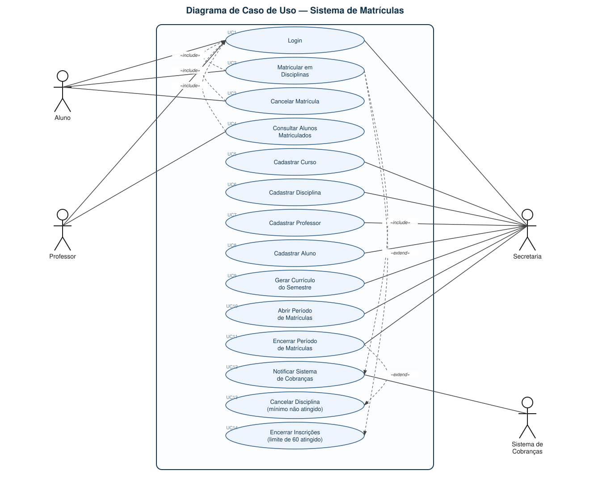
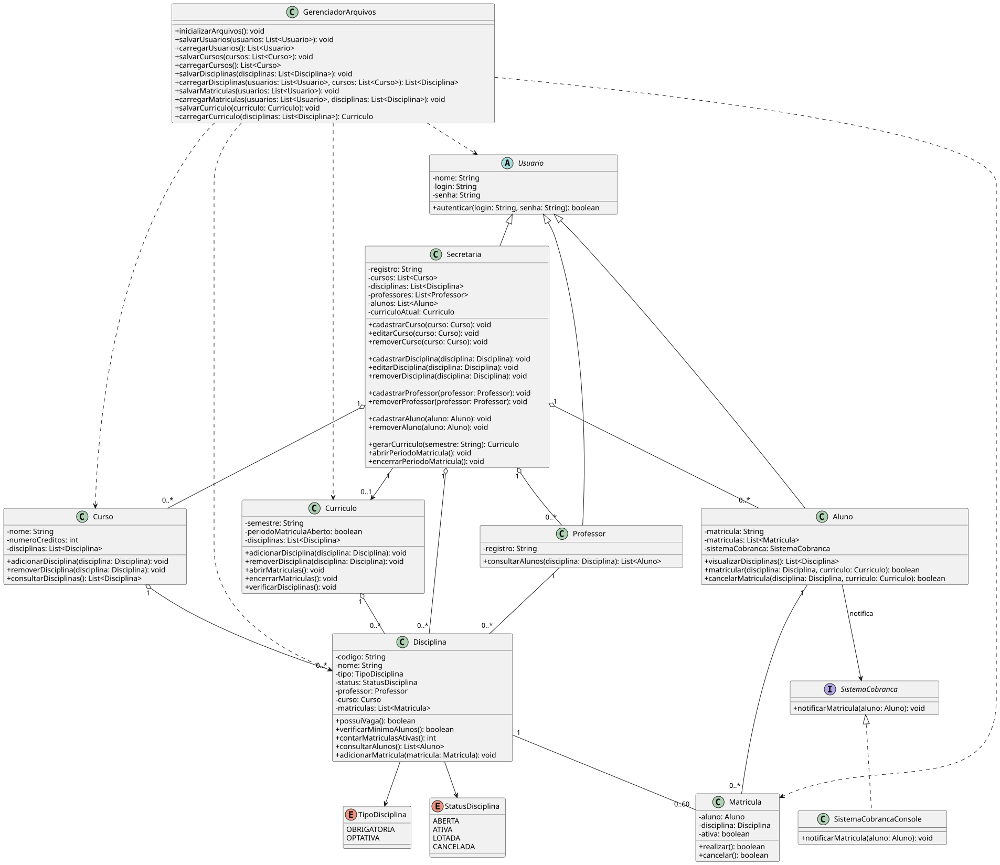

# 🎓 Sistema de Matrículas

Repositório dedicado ao desenvolvimento do **Sistema de Matrículas**, projeto prático desenvolvido para a disciplina de **Projeto de Software** da **PUC Minas**.

O objetivo do sistema é informatizar a gestão acadêmica de uma universidade, contemplando a oferta de disciplinas pela secretaria, o processo de matrícula dos alunos, o acompanhamento pelos professores e a notificação ao sistema de cobranças.

---

## 📚 Informações Acadêmicas

- **Instituição:** Pontifícia Universidade Católica de Minas Gerais (PUC Minas)
- **Curso:** Engenharia de Software
- **Disciplina:** Projeto de Software
- **Professora:** Milena Menezes Adão
- **Semestre:** 2º Semestre / 2026

---

## 👥 Equipe de Desenvolvimento

- Arthur Martins Candido
- Felipe Costa Lisboa
- Gustavo Leonardi Ribeiro de Almeida
- Sofia Fernandes Ferreira Silva

---

## 🚀 Status do Projeto: Sprint 03 (Lab01S03)

Fase atual de **implementação do protótipo funcional do Sistema de Matrículas**, utilizando Java, interface por linha de comando e persistência em arquivos.

### Entregas

#### Sprint 01 — Lab01S01

- [x] Diagrama de Casos de Uso (UML)
- [x] Histórias de Usuário (User Stories)

#### Sprint 02 — Lab01S02

- [x] Revisão dos diagramas desenvolvidos
- [x] Diagrama de Classes (UML)
- [x] Criação do projeto Java
- [x] Criação das classes e atributos modelados
- [x] Criação dos stubs dos métodos modelados

#### Sprint 03 — Lab01S03

- [x] Revisão e atualização dos modelos UML
- [x] Implementação da autenticação
- [x] Implementação dos perfis de Aluno, Professor e Secretaria
- [x] Implementação do CRUD de alunos
- [x] Implementação do CRUD de professores
- [x] Implementação do CRUD de cursos
- [x] Implementação do CRUD de disciplinas
- [x] Associação entre Curso e Disciplina
- [x] Implementação de matrícula e cancelamento
- [x] Implementação das regras de negócio
- [x] Geração do currículo semestral
- [x] Controle do período de matrícula
- [x] Consulta de alunos por disciplina
- [x] Notificação ao Sistema de Cobranças
- [x] Interface por linha de comando (CLI)
- [x] Persistência dos dados em arquivos

---

## 1. Descrição do Sistema

O sistema tem como objetivo informatizar o processo de matrículas de uma universidade.

A secretaria é responsável por gerar o currículo de cada semestre e manter as informações referentes aos cursos, disciplinas, professores e alunos.

Cada curso possui nome, número de créditos e disciplinas associadas.

Durante o período de matrículas, os alunos podem se matricular em até **4 disciplinas obrigatórias** e **2 disciplinas optativas**, além de cancelar matrículas realizadas anteriormente.

Uma disciplina somente ocorrerá no semestre seguinte caso possua, ao final do período de matrículas, pelo menos **3 alunos matriculados**. Caso contrário, a disciplina será cancelada.

Cada disciplina possui um limite máximo de **60 alunos**. Ao atingir esse limite, novas matrículas na disciplina são bloqueadas.

Após a realização da matrícula, o **Sistema de Cobranças** é notificado.

Os professores podem consultar os alunos matriculados nas disciplinas que lecionam.

Todos os usuários do sistema possuem login e senha para autenticação.

---

## 2. Diagrama de Casos de Uso



### Atores

- **Aluno**
- **Professor**
- **Secretaria**
- **Sistema de Cobranças** — sistema externo

### Relacionamentos

- `«include»`: Matricular, Cancelar Matrícula e Consultar Alunos exigem autenticação.
- `«include»`: ao realizar uma matrícula, o Sistema de Cobranças é notificado.
- `«extend»`: ao atingir 60 alunos, as inscrições da disciplina são encerradas.
- `«extend»`: ao encerrar o período de matrículas, disciplinas com menos de 3 alunos são canceladas.

### Operações de manutenção

Os casos de uso **Manter Curso**, **Manter Disciplina**, **Manter Professor** e **Manter Aluno** representam as operações de:

- Cadastrar
- Consultar
- Editar
- Remover

---

## 3. Histórias de Usuário

### 👨‍🎓 Aluno

- **US01** — Como aluno, quero fazer login com usuário e senha, para acessar as funcionalidades de matrícula.
- **US02** — Como aluno, quero visualizar as disciplinas obrigatórias e optativas do período de matrícula, para escolher em quais me matricular.
- **US03** — Como aluno, quero me matricular em até 4 disciplinas obrigatórias e 2 optativas, para compor minha grade do semestre.
- **US04** — Como aluno, quero cancelar uma matrícula feita anteriormente, durante o período de matrículas, para ajustar minha grade.
- **US05** — Como aluno, quero ser impedido de me matricular em uma disciplina que já atingiu 60 alunos, para respeitar o limite de vagas.
- **US06** — Como aluno matriculado, quero que o sistema de cobranças seja notificado automaticamente.

### 👨‍🏫 Professor

- **US07** — Como professor, quero fazer login no sistema, para acessar as informações das minhas disciplinas.
- **US08** — Como professor, quero consultar a lista de alunos matriculados em cada disciplina que leciono, para me preparar para o semestre.

### 🏫 Secretaria

- **US09** — Como secretária, quero fazer login no sistema, para gerenciar cursos, disciplinas, professores e alunos.
- **US10** — Como secretária, quero manter cursos (cadastrar, consultar, editar e remover), com nome e número de créditos, para organizar a oferta acadêmica.
- **US11** — Como secretária, quero manter disciplinas (cadastrar, consultar, editar e remover) associadas a um curso, para compor o currículo de cada semestre.
- **US12** — Como secretária, quero manter professores e alunos (cadastrar, consultar, editar e remover), para que possam fazer login no sistema.
- **US13** — Como secretária, quero gerar o currículo de cada semestre, para disponibilizar as disciplinas que os alunos podem cursar.
- **US14** — Como secretária, quero abrir e encerrar o período de matrículas, para controlar quando os alunos podem se matricular ou cancelar.

### ⚙️ Regras de Negócio Automáticas

- **US15** — Como sistema, quero cancelar automaticamente disciplinas com menos de 3 alunos matriculados ao final do período de matrículas.
- **US16** — Como sistema, quero encerrar automaticamente as inscrições de uma disciplina ao atingir 60 alunos matriculados.

---

## 4. Diagrama de Classes

O Diagrama de Classes foi atualizado durante a Sprint 03 para refletir as alterações identificadas durante a implementação do protótipo.



### Principais classes

- `Usuario`
- `Aluno`
- `Professor`
- `Secretaria`
- `Curso`
- `Curriculo`
- `Disciplina`
- `Matricula`
- `GerenciadorArquivos`

### Tipos auxiliares

- `TipoDisciplina`
- `StatusDisciplina`

### Sistema externo

- `SistemaCobranca`
- `SistemaCobrancaConsole`

### Alterações realizadas durante a implementação

Durante a implementação da Sprint 03, o modelo de classes foi revisado para manter o alinhamento entre a modelagem e o código desenvolvido.

As principais alterações foram:

- inclusão da associação entre `Curso` e `Disciplina`;
- inclusão das matrículas mantidas pelo `Aluno`;
- inclusão das matrículas associadas à `Disciplina`;
- adequação das operações de matrícula e cancelamento para considerar o `Curriculo`;
- inclusão das coleções gerenciadas pela `Secretaria`;
- inclusão da implementação `SistemaCobrancaConsole`;
- inclusão do `GerenciadorArquivos`, responsável pela persistência;
- atualização dos relacionamentos de acordo com a implementação final.

A classe abstrata `Usuario` concentra as informações comuns de autenticação. `Aluno`, `Professor` e `Secretaria` especializam essa classe.

A classe `Matricula` representa a associação entre um aluno e uma disciplina.

Cada `Disciplina` é associada a um `Curso`, possui um professor responsável e mantém suas matrículas.

---

## 5. Regras de Negócio

O protótipo implementa as seguintes regras:

1. Um aluno pode se matricular em no máximo **4 disciplinas obrigatórias**.
2. Um aluno pode se matricular em no máximo **2 disciplinas optativas**.
3. Uma disciplina pode possuir no máximo **60 alunos matriculados**.
4. Ao atingir 60 alunos, novas matrículas na disciplina são bloqueadas.
5. Ao final do período de matrículas, uma disciplina precisa possuir pelo menos **3 alunos matriculados**.
6. Disciplinas com menos de 3 alunos ao final do período são canceladas.
7. Matrículas e cancelamentos somente podem ser realizados enquanto o período de matrículas estiver aberto.
8. O Sistema de Cobranças é notificado após a realização da matrícula.
9. Professores somente consultam os alunos das disciplinas que lecionam.
10. O acesso às funcionalidades do sistema requer autenticação por login e senha.
11. Cada disciplina deve estar associada a um curso.

---

## 6. Implementação

O sistema foi desenvolvido utilizando **Java**, seguindo os modelos UML definidos durante as etapas de análise e projeto.

A aplicação é executada por **linha de comando (CLI)** e apresenta menus específicos de acordo com o tipo de usuário autenticado.

A persistência é realizada utilizando **arquivos de texto**, sem utilização de banco de dados.

### Funcionalidades da Secretaria

A Secretaria pode:

- cadastrar, listar, editar e remover alunos;
- cadastrar, listar, editar e remover professores;
- cadastrar, listar, editar e remover cursos;
- cadastrar, listar, editar e remover disciplinas;
- associar uma disciplina a um curso;
- associar um professor a uma disciplina;
- gerar o currículo de um semestre;
- abrir o período de matrículas;
- encerrar o período de matrículas;
- consultar o status do período.

### Funcionalidades do Aluno

O Aluno pode:

- realizar login;
- visualizar as disciplinas disponíveis;
- realizar matrícula;
- cancelar matrícula;
- consultar suas matrículas ativas.

### Funcionalidades do Professor

O Professor pode:

- realizar login;
- visualizar suas disciplinas;
- consultar os alunos matriculados nas disciplinas que leciona.

### Sistema de Cobranças

A integração com o Sistema de Cobranças é representada pela interface `SistemaCobranca`.

Para o protótipo, a implementação `SistemaCobrancaConsole` simula a comunicação com o sistema externo exibindo a notificação no terminal.

---

## 7. Persistência em Arquivos

Os dados do sistema são armazenados no diretório `data/`.

São utilizados os seguintes arquivos:

```text
data/
├── usuarios.txt
├── cursos.txt
├── disciplinas.txt
├── matriculas.txt
└── curriculo.txt
```

O `GerenciadorArquivos` é responsável pela leitura e gravação dos dados.

A persistência mantém informações de:

- usuários;
- alunos e professores;
- cursos;
- disciplinas;
- associação entre curso e disciplina;
- professor responsável pela disciplina;
- matrículas;
- currículo;
- status das disciplinas;
- estado do período de matrícula.

Ao iniciar a aplicação, os dados armazenados nos arquivos são carregados e as associações entre os objetos são reconstruídas.

---

## 8. Estrutura do Projeto

```text
sistema-de-matricula/
│
├── data/
│   ├── usuarios.txt
│   ├── cursos.txt
│   ├── disciplinas.txt
│   ├── matriculas.txt
│   └── curriculo.txt
│
├── diagrams/
│   ├── use_case_diagram.svg
│   └── class_diagram.svg
│
├── src/
│   ├── App.java
│   │
│   ├── model/
│   │   ├── Usuario.java
│   │   ├── Aluno.java
│   │   ├── Professor.java
│   │   ├── Secretaria.java
│   │   ├── Curso.java
│   │   ├── Curriculo.java
│   │   ├── Disciplina.java
│   │   ├── Matricula.java
│   │   ├── TipoDisciplina.java
│   │   └── StatusDisciplina.java
│   │
│   ├── external/
│   │   ├── SistemaCobranca.java
│   │   └── SistemaCobrancaConsole.java
│   │
│   └── persistence/
│       └── GerenciadorArquivos.java
│
├── .gitignore
└── README.md
```

---

## 9. Execução

Para executar o projeto, é necessário possuir o Java instalado.

A aplicação é iniciada pela classe:

```text
src/App.java
```

Ao iniciar o sistema pela primeira vez, são criados usuários iniciais para permitir o acesso ao protótipo.

### Usuários iniciais

| Perfil | Login | Senha |
|---|---|---|
| Secretaria | `secretaria` | `123` |
| Professor | `professor` | `123` |
| Aluno | `aluno` | `123` |

Os demais usuários podem ser cadastrados pela Secretaria.

---

## 10. Fluxo Principal do Protótipo

Um fluxo básico de utilização do sistema é:

1. A Secretaria realiza login.
2. Cadastra cursos, professores, alunos e disciplinas.
3. Cada disciplina é associada a um curso e a um professor.
4. A Secretaria gera o currículo do semestre.
5. A Secretaria abre o período de matrículas.
6. Os alunos realizam login e efetuam suas matrículas.
7. O Sistema de Cobranças é notificado após a matrícula.
8. Os professores consultam os alunos matriculados em suas disciplinas.
9. Os alunos podem cancelar matrículas enquanto o período estiver aberto.
10. A Secretaria encerra o período de matrículas.
11. O sistema verifica a quantidade de alunos de cada disciplina.
12. Disciplinas com menos de 3 alunos são canceladas.

---

## 11. Validação do Protótipo

Foram validados fluxos e regras de negócio como:

- autenticação dos usuários;
- operações CRUD da Secretaria;
- matrícula e cancelamento;
- limite de disciplinas obrigatórias e optativas;
- ativação de disciplina com o mínimo necessário de alunos;
- cancelamento de disciplina abaixo do mínimo;
- consulta de alunos pelo professor;
- persistência dos dados após reinicialização da aplicação;
- múltiplas reinicializações sem duplicação dos dados;
- reconstrução dos relacionamentos entre os objetos a partir dos arquivos.

---

## 12. Evolução do Projeto

A Sprint 03 resultou em um protótipo funcional do Sistema de Matrículas.

Durante a implementação, os modelos desenvolvidos nas etapas anteriores foram revisados para refletir a solução implementada. Entre as principais evoluções estão a implementação da persistência em arquivos, o gerenciamento das matrículas, o controle do período de matrícula e a associação explícita entre cursos e disciplinas.

O código-fonte e os diagramas UML presentes neste repositório representam a versão atual do projeto ao final da Sprint 03.